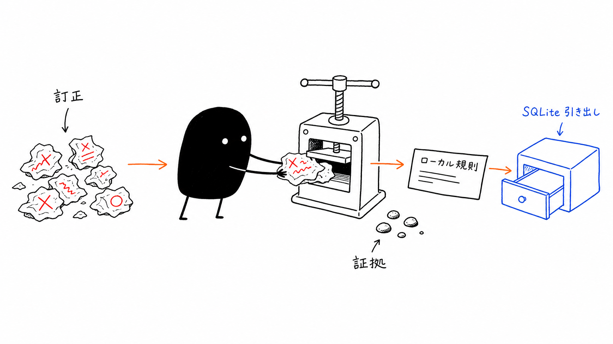
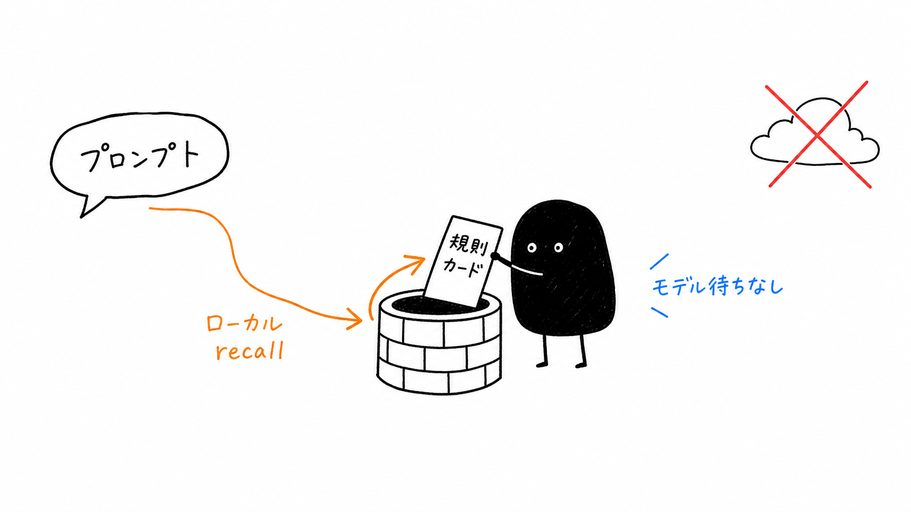
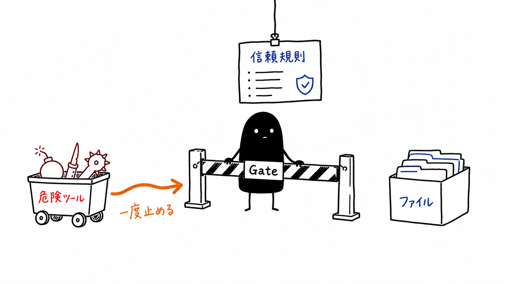

# Nokori 残り

<p align="center">
  
</p>

<p align="center">
  <strong>訂正を持続する Agent の行動へ変える、ローカルファーストの記憶層。</strong>
</p>

<p align="center">
  <a href="https://pypi.org/project/nokori/"></a>
  = 3.11" />
  <a href="https://github.com/KorenKrita/nokori/blob/main/LICENSE"></a>
  
  
  
  
  
</p>

<p align="center">
  <sub>訂正を記憶する · 文脈にルールを呼び戻す · 危険なツール呼び出しを止める · すべてローカルに保存する</sub>
</p>

<p align="center">
  <b>Languages:</b> <a href="README.md">English</a> | <a href="README.zh-CN.md">简体中文</a> | <a href="README.zh-TW.md">繁體中文</a> | <b>日本語</b>
</p>

<p align="center">
  <a href="#クイックインストール">インストール</a> · <a href="#1分で理解する">仕組み</a> · <a href="docs/ja/architecture.md">アーキテクチャ</a> · <a href="docs/ja/configuration.md">設定</a> · <a href="docs/ja/cli.md">CLI リファレンス</a> · <a href="docs/ja/web-ui.md">Web UI</a>
</p>

---

> 経験が残すものは、記憶より深い。

残り（nokori）——騒がしさが過ぎ去ったあとも、その場にとどまっているもの。

対話が終わるたび、あなたが正した言葉は蒸発する。次のセッションで Agent はまた見知らぬ他人に戻る。平気で強制 push し、マイグレーションを流し忘れ、本番 DB に危険なコマンドを叩き込むあの他人に。

Nokori は忘れさせない。あなたの「こうするな」を呼び戻せる行動ルールとして沈殿させる。次にあなたの言葉があの場面に近づけば、ルールが自ずと Agent のコンテキストへ浮かび上がる。新しいルールはまず candidate として影に置かれ、コールドパスと事後エビデンスが信頼に足ると判断してから、もっとも鋭いものだけが Gate の資格を得る——Agent がファイルに触れる前に、最初の危険なツール呼び出しを一度止めるために。

データは終始あなたのマシン上の SQLite に残る。チャット中の検索はモデルに一切触れない。LLM を使うのはセッション終了後の抽出だけで、渡すのは圧縮済みの会話断片にすぎない。完全オフラインにしたければ、エンドポイントをローカルの Ollama に向ければいい。

<p align="center">
  
  <br />
  <sub>訂正が入り、ローカルの行動ルールとして残る。</sub>
</p>

---

## こんな人に向いている

<table>
  <tr>
    <td width="33%">
      <strong>同じミスを何度も直している人</strong><br />
      強制 push、マイグレーション忘れ、間違った DB へのコマンド。Nokori はセッション後もその訂正を覚えている。
    </td>
    <td width="33%">
      <strong>プロジェクト横断の好みを保ちたい人</strong><br />
      行動ルールを一度教えれば、repo ごとに同じ instruction stack を組み直さなくてよい。
    </td>
    <td width="33%">
      <strong>ローカルファーストで運用したい人</strong><br />
      ルールは手元の SQLite に保存され、いつでもエクスポート可能。検索時に会話全文が外へ出ることはない。
    </td>
  </tr>
</table>

## Before / After

| Nokori なし | Nokori あり |
|-------------|-------------|
| 同じ訂正をセッションごとに繰り返す | 訂正が持続する行動ルールになる |
| 危険なツール呼び出しは Agent の記憶頼み | trusted Gate ルールが実行前に一度止められる |
| 好みはチャットウィンドウと一緒に消える | ルールはローカルに残り、プロジェクトをまたいで使える |
| 検索にはモデル待ちが必要 | ホットパスの recall は決定的なファイル I/O とスコアリングだけ |

---

## 1分で理解する

```
あなたが Claude / Cursor を正す
    └─▶ Nokori が掟を1件刻む（どんな場面 + どうすべきか）
            └─▶ 次にあなたの言葉がその場面に近づく
                    └─▶ 掟が自ずと Agent のコンテキストへ書き込まれる（リマインド）
                            └─▶ やがて trusted + gate_eligible になれば：
                                 最初のファイル編集 / コマンド実行の前に、一度差し止める（Gate）
```

チャット中 Nokori がやるのは検索と小さなファイルの読み書きだけ。モデル待ちでブロックしない。LLM はセッション終了後、transcript（会話記録）から新ルールを抽出するときだけ動く。

<p align="center">
  
  <br />
  <sub>チャット中の recall はローカルで決定的。モデル待ちはない。</sub>
</p>

---

## クイックインストール

4 コマンド。ローカル記憶。ホスト型データベースなし。

**前提条件**：Python >= 3.11、Claude Code または Cursor がインストール済み

```bash
# 推奨：pipx でインストール（ローカル意味検索込み）
brew install pipx && pipx ensurepath
pipx install "nokori[local-embed]"

# Hook を登録
nokori install --all        # または --cursor / デフォルトは Claude Code のみ

# 動作確認
nokori health
```

<details>
<summary>その他のインストール方法</summary>

```bash
# 最小インストール（BM25 のみ、ローカルモデルなし）
pipx install nokori

# 専用 venv
python3 -m venv ~/.local/venvs/nokori
~/.local/venvs/nokori/bin/pip install "nokori[local-embed]"
echo 'export PATH="$HOME/.local/venvs/nokori/bin:$PATH"' >> ~/.zshrc

# ソースから
git clone https://github.com/KorenKrita/nokori.git && cd nokori
python3 -m venv .venv && source .venv/bin/activate
pip install -e ".[local-embed,dev]"
```

</details>

> 詳しいインストールガイド（Cursor 設定、更新、アンインストール等）は[インストール文書](docs/ja/installation.md)を参照

---

## クイックスタート

```bash
# 1. candidate ルールを追加
nokori add \
  --trigger "Force pushing to a shared branch" \
  --action "Use --force-with-lease, or push to a new branch" \
  --severity high_risk

# 2. シャドウヒットを確認
nokori test "I'll just git push --force this branch"

# 3. メンテナンス実行（エビデンスに基づきルールを昇格）
nokori maintain

# 4. ルールが古くなったら退役
nokori dismiss <short_id>
```

普段どおり Claude Code / Cursor でコードを書けばよい。ルールにマッチすると、Agent の返信前にリマインドが注入される。`trusted` + `gate_eligible` のルールは、最初の敏感なツール呼び出しを一度差し止める。

<p align="center">
  
  <br />
  <sub>信頼されたルールは、危険なツール呼び出しがファイルへ届く前に一度止められる。</sub>
</p>

---

## コア機能

<table>
  <tr>
    <td width="50%">
      <strong>自律品質フライホイール</strong><br />
      candidate → active → trusted。ルールはエビデンスを積んでから権限を得る。
    </td>
    <td width="50%">
      <strong>ホットパスで LLM 呼び出しゼロ</strong><br />
      Hook は決定的な検索、マッチ、スコアリングだけ。prompt と返信の間にモデル待ちはない。
    </td>
  </tr>
  <tr>
    <td width="50%">
      <strong>ハイブリッド検索</strong><br />
      BM25 はすぐ使える。ローカルまたはリモートの意味ベクトルも任意で使え、両方あるときは RRF で融合する。
    </td>
    <td width="50%">
      <strong>保守的な Gate</strong><br />
      trusted + gate_eligible のルールだけがツールを差し止め、しかも各ターン一度きり。
    </td>
  </tr>
  <tr>
    <td width="50%">
      <strong>シャドウエビデンス</strong><br />
      Candidate はバックグラウンドで反事実エビデンスを蓄積し、現在の対話には干渉しない。
    </td>
    <td width="50%">
      <strong>ローカルファーストの保存</strong><br />
      SQLite + ファイルシステム。recall 中にデータは手元を離れず、オフライン LLM も選べる。
    </td>
  </tr>
  <tr>
    <td width="50%">
      <strong>クロスツール対応</strong><br />
      Claude Code と Cursor をネイティブにサポート。
    </td>
    <td width="50%">
      <strong>Web UI</strong><br />
      <code>nokori web</code> で、ルール、ログ、ライフサイクル状態、設定を可視化できる。
    </td>
  </tr>
</table>

---

## ドキュメント

| ガイド | 分かること |
|--------|------------|
| 🚀 [インストールガイド](docs/ja/installation.md) | pipx インストール、Cursor 設定、更新とアンインストール |
| 🧠 [アーキテクチャ](docs/ja/architecture.md) | フライホイール機構、Hook タイミング、注入 vs Gate、Shadow Pool |
| ⚙️ [設定](docs/ja/configuration.md) | `config.toml`、環境変数、完全リファレンス |
| 🔎 [検索エンジン](docs/ja/retrieval.md) | BM25、Embedding、RRF 融合、注入階層 |
| 🌱 [ルールのライフサイクル](docs/ja/lifecycle.md) | 状態機械、昇格エビデンス、メンテナンスタスク |
| 🧊 [自動抽出](docs/ja/extraction.md) | コールドパスパイプライン、マージ戦略、Async モード |
| 🛡️ [Gate 機構](docs/ja/gate.md) | 二層マッチ、設定、Prompt-hash 安全機構 |
| ⌨️ [CLI リファレンス](docs/ja/cli.md) | 全コマンドとオプション |
| 🖥️ [Web UI](docs/ja/web-ui.md) | 可視化パネルの機能と開発 |

---

## 既存システムとの関係

| システム | 関係 |
|----------|------|
| CLAUDE.md | 補完関係。Nokori は CLAUDE.md に触れない。動的な「Xに遭遇したらYする」を管理する |
| Claude Code auto-memory | 競合しない。memory は事実を記憶し、Nokori は行動規則を記憶する |
| 他の memory プラグイン | Hook は共存可能だが、コンテキストに注入する系のプラグインを重ねすぎないこと |

---

## データ保管

すべてのデータはローカルの `~/.nokori/` 一つのディレクトリに収まる。ネットワーク同期なし。ルールに含まれるのは行動の記述であり、ソースコードではない。LLM を使うのはコールドパスの抽出だけで、エンドポイントをローカル Ollama に向ければ完全オフライン運用が可能。

---

## 開発

```bash
python3 -m venv .venv && source .venv/bin/activate
pip install -e ".[local-embed,dev]"
python -m pytest tests/
```

プロジェクト制約：ホットパス hook は stdlib + urllib のみ使用（prompt と返答の間に LLM 呼び出しなし）、すべての hook はトップレベル try/except で fail-open。ベースインストールには Web ダッシュボード用の fastapi + uvicorn を含む。

---

## License

MIT
