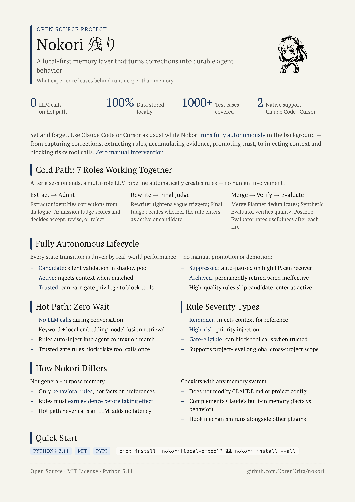
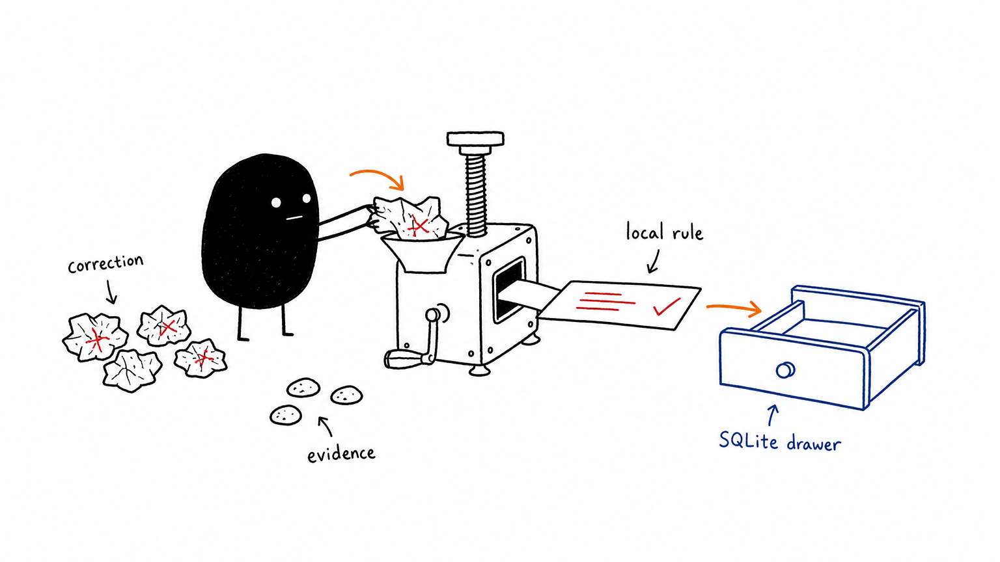
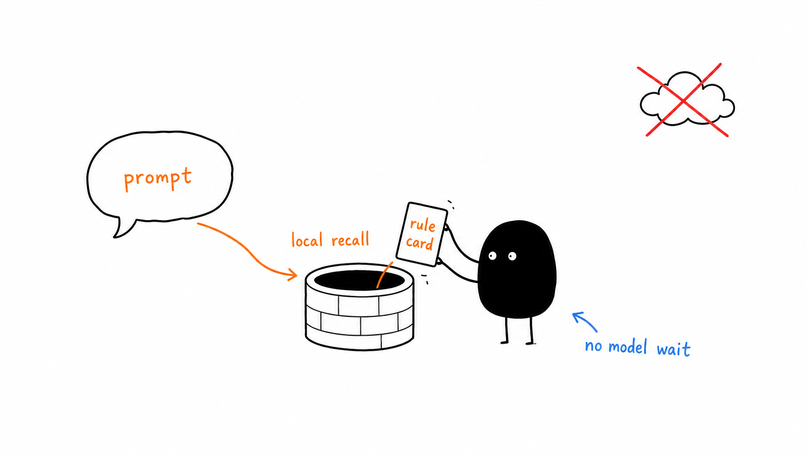
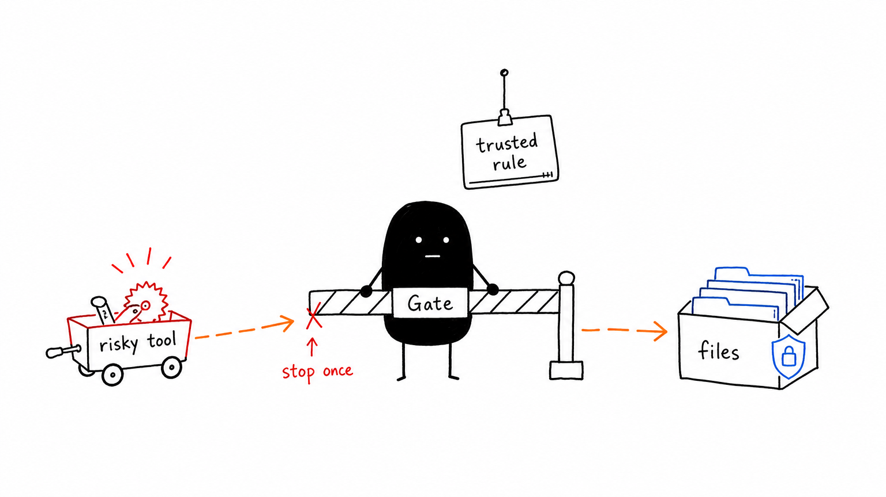

# Nokori 残り

<p align="center">
  
</p>

<p align="center">
  <strong>A local-first memory layer that turns corrections into durable agent behavior.</strong>
</p>

<p align="center">
  <a href="https://pypi.org/project/nokori/"></a>
  = 3.11" />
  <a href="https://github.com/KorenKrita/nokori/blob/main/LICENSE"></a>
  
  
  
  
</p>

<p align="center">
  <sub>remembers corrections · recalls rules in context · blocks risky tools · stores everything locally</sub>
</p>

<p align="center">
  <b>Languages:</b> <b>English</b> | <a href="README.zh-CN.md">简体中文</a> | <a href="README.zh-TW.md">繁體中文</a> | <a href="README.ja.md">日本語</a>
</p>

<p align="center">
  <a href="#quick-install">Quick Install</a> · <a href="#one-minute-overview">How It Works</a> · <a href="docs/en/architecture.md">Architecture</a> · <a href="docs/en/configuration.md">Configuration</a> · <a href="docs/en/cli.md">CLI Reference</a> · <a href="docs/en/web-ui.md">Web UI</a>
</p>

---

> What experience leaves behind runs deeper than memory.

Nokori (残り) means what remains: the thing still standing in place after the noise dies down.

Every session ends, and every correction you made evaporates with it. In the next session the agent wakes a stranger again, the same stranger who force-pushes, forgets to run the migration, types a dangerous command straight at the production database.

Nokori refuses to let it forget. It settles every "don't do that" you ever said into recallable behavioral rules: when your words drift back toward that scene, the rule surfaces on its own inside the agent's context. New rules first live as candidates underwater, collecting evidence in the background. Only after the cold path and posthoc evidence trust them can the sharpest ones become Gate-eligible and block the first risky tool call before the agent touches your files.

Your data stays on your machine, in SQLite, the whole way through. Retrieval during a chat never touches a model. Only the post-session extract calls an LLM, and even then it is fed nothing but compressed session fragments. Want it fully offline? Point the endpoint at a local Ollama.

<p align="center">
  
</p>

---

## Who is it for

<table>
  <tr>
    <td width="33%">
      <strong>Repeat mistake hunters</strong><br />
      Force pushes, forgotten migrations, commands fired at the wrong database: Nokori remembers the correction after the chat ends.
    </td>
    <td width="33%">
      <strong>Cross-repo preference keepers</strong><br />
      Teach a behavioral rule once and carry it across projects instead of rebuilding the same instruction stack in every repo.
    </td>
    <td width="33%">
      <strong>Local-first operators</strong><br />
      Rules sit in SQLite on your own machine, exportable anytime; whole chats are never sent out during retrieval.
    </td>
  </tr>
</table>

## Before / After

| Without Nokori | With Nokori |
|----------------|-------------|
| The same correction is repeated every session | The correction becomes a durable behavioral rule |
| Risky tool calls rely on the agent remembering context | Trusted Gate rules can block before the tool runs |
| Preferences vanish with the chat window | Rules stay local and follow you across projects |
| Retrieval means waiting on a model | Hot-path recall is deterministic file I/O + scoring |

<p align="center">
  
  <br />
  <sub>Every correction is distilled into a durable local rule.</sub>
</p>

---

## One minute overview

```
You correct Claude Code / Cursor / OMP
    └─▶ Nokori carves a rule (what scene + what to do)
            └─▶ Next time your words drift near that scene
                    └─▶ The rule auto-writes into the agent's context (reminder)
                            └─▶ If it later becomes trusted + gate_eligible:
                                 block once before the first matching tool call (Gate)
```

During a chat Nokori only does retrieval and small file I/O, never making you wait on a model. The LLM is only called after the session closes, when it extracts new rules from the transcript at its own pace.

<p align="center">
  
  <br />
  <sub>During the chat, recall stays local and deterministic.</sub>
</p>

---

## Quick install

A few commands. Local memory. No hosted database.

**Prerequisites**: Python >= 3.11, Claude Code, Cursor, or OMP already installed

```bash
# Recommended: pipx with local semantic retrieval
brew install pipx && pipx ensurepath
pipx install "nokori[local-embed]"

# Register hooks
nokori install --omp        # OMP only -> ~/.omp/agent/extensions/nokori.ts
# Use --all for Claude Code + Cursor, --cursor for Cursor, default for Claude Code only

# Verify
nokori health
ls ~/.omp/agent/extensions/nokori.ts
```

On OMP, recall is injected on `before_agent_start`, Gate checks run on `tool_call`, and post-session extraction starts on `session_shutdown` using the current session file from OMP's session manager.

<details>
<summary>Other install methods</summary>

```bash
# Minimal install (BM25 only, no local model)
pipx install nokori

# Dedicated venv
python3 -m venv ~/.local/venvs/nokori
~/.local/venvs/nokori/bin/pip install "nokori[local-embed]"
echo 'export PATH="$HOME/.local/venvs/nokori/bin:$PATH"' >> ~/.zshrc

# From source
git clone https://github.com/KorenKrita/nokori.git && cd nokori
python3 -m venv .venv && source .venv/bin/activate
pip install -e ".[local-embed,dev]"
```

</details>

> Full installation guide (Claude Code / Cursor / OMP config, updating, uninstalling) in [Installation](docs/en/installation.md)

---

## Quick start

```bash
# 1. Add a candidate rule
nokori add \
  --trigger "Force pushing to a shared branch" \
  --action "Use --force-with-lease, or push to a new branch" \
  --severity high_risk

# 2. Verify the shadow match
nokori test "I'll just git push --force this branch"

# 3. Run maintenance (let evidence move rules forward)
nokori maintain

# 4. Rule out of date? Dismiss it
nokori dismiss <short_id>
```

Just open Claude Code, Cursor, or OMP and work as usual. When a rule matches, the agent sees the injected reminder before it replies. For `trusted` + `gate_eligible` rules, the first sensitive tool call is blocked once.

<p align="center">
  
  <br />
  <sub>Trusted rules can stop the first risky tool call before it reaches your files.</sub>
</p>

---

## Core features

<table>
  <tr>
    <td width="50%">
      <strong>Autonomous quality flywheel</strong><br />
      candidate → active → trusted; rules must earn evidence before gaining authority.
    </td>
    <td width="50%">
      <strong>Zero model calls on the hot path</strong><br />
      Hooks do deterministic retrieval, matching, and scoring only; no LLM wait between prompt and reply.
    </td>
  </tr>
  <tr>
    <td width="50%">
      <strong>Hybrid retrieval</strong><br />
      BM25 out of the box, optional local or remote semantic vectors, and RRF fusion when both are available.
    </td>
    <td width="50%">
      <strong>Conservative Gate</strong><br />
      Only trusted + gate_eligible rules can block tools, and only once per turn.
    </td>
  </tr>
  <tr>
    <td width="50%">
      <strong>Shadow evidence</strong><br />
      Candidates accumulate counterfactual evidence in the background without disturbing the current chat.
    </td>
    <td width="50%">
      <strong>Local-first storage</strong><br />
      SQLite + filesystem, data never leaves your machine during recall, and offline LLMs are optional.
    </td>
  </tr>
  <tr>
    <td width="50%">
      <strong>Cross-tool support</strong><br />
      Native Claude Code and Cursor hooks, plus OMP through a small TypeScript bridge that reuses the same Python dispatcher.
    </td>
    <td width="50%">
      <strong>Web UI</strong><br />
      Run <code>nokori web</code> for a visual dashboard to inspect rules, logs, lifecycle state, and configuration.
    </td>
  </tr>
</table>

---

## Documentation

| Guide | What it gives you |
|-------|-------------------|
| 🚀 [Installation](docs/en/installation.md) | pipx install, Cursor config, updates, uninstalling |
| 🧠 [Architecture](docs/en/architecture.md) | flywheel mechanism, hook timing, injection vs Gate, Shadow Pool |
| ⚙️ [Configuration](docs/en/configuration.md) | `config.toml`, environment variables, full reference |
| 🔎 [Retrieval Engine](docs/en/retrieval.md) | BM25, embeddings, RRF fusion, injection tiers |
| 🌱 [Rule Lifecycle](docs/en/lifecycle.md) | state machine, promotion evidence, maintenance tasks |
| 🧊 [Automatic Extraction](docs/en/extraction.md) | cold-path pipeline, merge strategy, async mode |
| 🛡️ [Gate Mechanism](docs/en/gate.md) | two-layer matching, configuration, prompt-hash safety |
| ⌨️ [CLI Reference](docs/en/cli.md) | all commands and options |
| 🖥️ [Web UI](docs/en/web-ui.md) | visual dashboard features and development |

---

## Relationship with existing systems

| System | Relationship |
|--------|--------------|
| CLAUDE.md | Complementary. Nokori doesn't touch your CLAUDE.md; it handles the dynamic "when X, do Y" |
| Claude Code auto-memory | No conflict. Memory leans factual, Nokori leans behavioral rules |
| Other memory plugins | Hooks can coexist, but avoid stacking many context-injection plugins |

---

## Data storage

All data lives in one local directory, `~/.nokori/`. There is no network sync. Rules store behavioral descriptions, not your source code. Only the cold-path extract calls an LLM; point the endpoint at a local Ollama for fully offline operation.

---

## Development

```bash
python3 -m venv .venv && source .venv/bin/activate
pip install -e ".[local-embed,dev]"
python -m pytest tests/
```

Project constraints: hot-path hooks use only stdlib + urllib (no LLM calls between prompt and reply), all hooks wrapped in top-level try/except fail-open. Base install includes fastapi + uvicorn for the web dashboard.

---

## License

MIT
