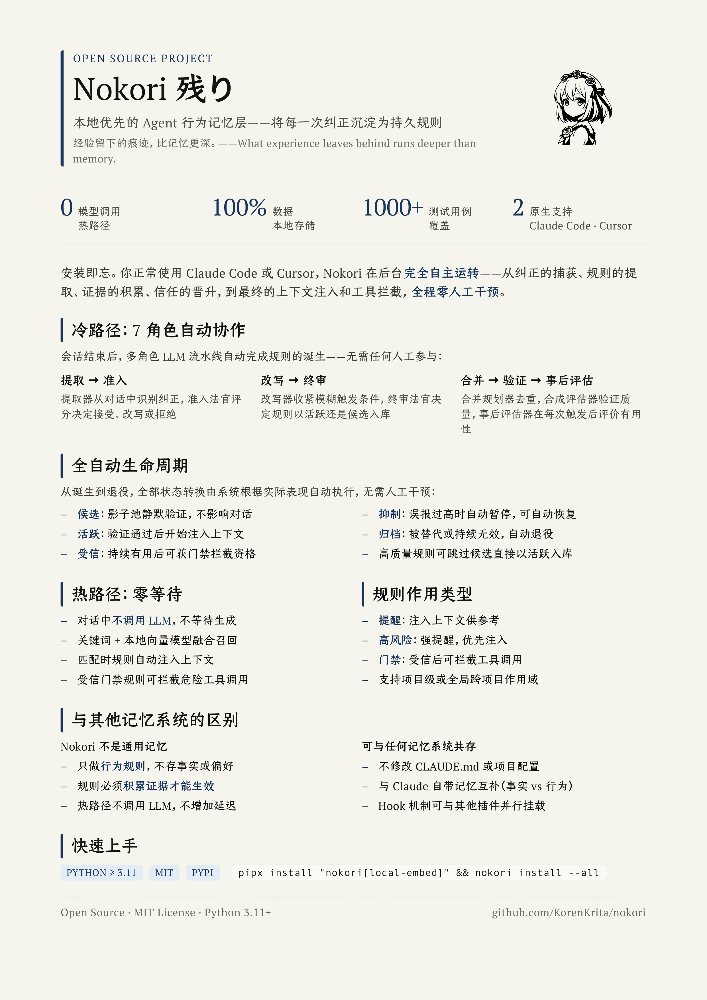
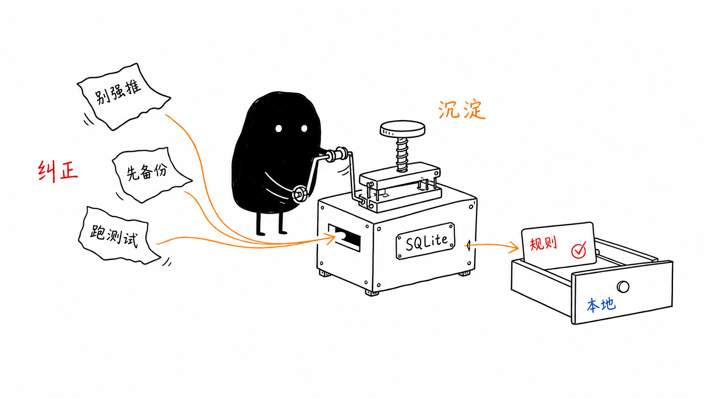
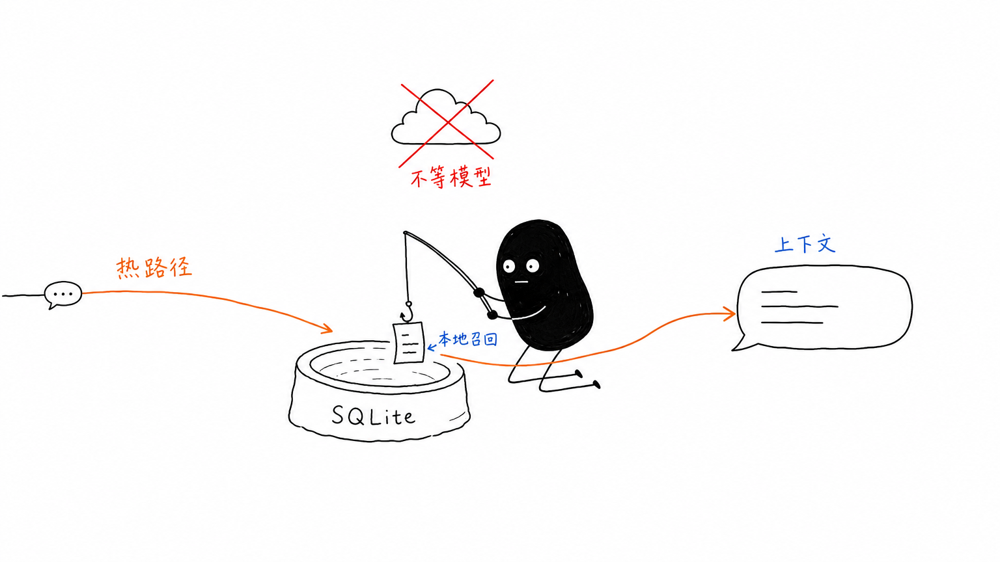
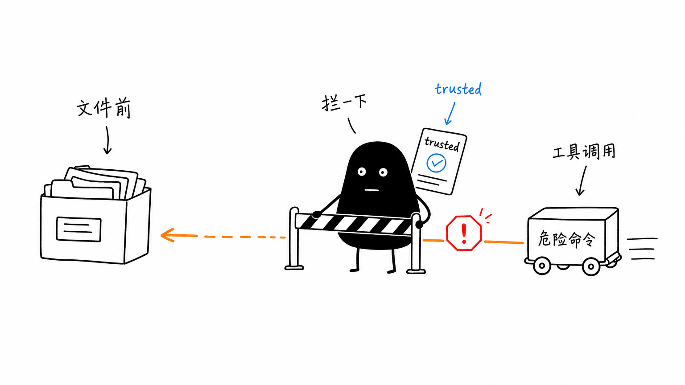

# Nokori 残り

<p align="center">
  
</p>

<p align="center">
  <strong>本地优先的记忆层，把纠正沉淀成持久的 Agent 行为。</strong>
</p>

<p align="center">
  <a href="https://pypi.org/project/nokori/"></a>
  = 3.11" />
  <a href="https://github.com/KorenKrita/nokori/blob/main/LICENSE"></a>
  
  
  
  
  
</p>

<p align="center">
  <sub>记住纠正 · 在上下文中召回规则 · 拦截危险工具调用 · 数据全程本地保存</sub>
</p>

<p align="center">
  <b>Languages:</b> <a href="README.md">English</a> | <b>简体中文</b> | <a href="README.zh-TW.md">繁體中文</a> | <a href="README.ja.md">日本語</a>
</p>

<p align="center">
  <a href="#快速安装">快速安装</a> · <a href="#一分钟看懂">工作原理</a> · <a href="docs/zh-CN/architecture.md">架构详解</a> · <a href="docs/zh-CN/configuration.md">配置</a> · <a href="docs/zh-CN/cli.md">CLI 参考</a> · <a href="docs/zh-CN/web-ui.md">Web UI</a>
</p>

---

> 经验留下的痕迹，比记忆更深。

残り（nokori），意为残留之物：喧嚣散场之后，仍旧留在原地的东西。

每一次对话结束，你纠正过的话都随之蒸发。下一个 session 里，Agent 重新变回那个会强推、会忘跑迁移、会对着生产库敲下危险命令的陌生人。

Nokori 偏不让它忘。它把你说过的「别这么干」沉淀成可召回的行为规则：当你的话再次逼近那个场景，规则自动浮现在 Agent 的上下文里。新规则先作为候选沉在水下，经冷路径和事后证据确认可靠后，最锋利的那几条才会获得 Gate 资格，在 Agent 碰文件之前拦下第一次危险工具调用。

数据全程留在你机器上的 SQLite 里。聊天时的检索不碰任何模型。只有关会话后的提取才动用 LLM，喂给它的也只是压缩过的会话片段；想彻底离线，端点指向本地 Ollama 就行。

<p align="center">
  
</p>

---

## 它适合谁

<table>
  <tr>
    <td width="33%">
      <strong>反复踩坑的人</strong><br />
      强推、忘跑迁移、对着错误的库敲命令：Nokori 会在会话结束后记住这次纠正。
    </td>
    <td width="33%">
      <strong>跨项目偏好维护者</strong><br />
      一次教会一条行为规则，让它跟着你跨项目流动，而不是每开一个 repo 就重建一套提示。
    </td>
    <td width="33%">
      <strong>本地优先使用者</strong><br />
      规则存储在本机 SQLite，随时导出；检索时整段聊天不会外传。
    </td>
  </tr>
</table>

## Before / After

| 没有 Nokori | 有了 Nokori |
|-------------|-------------|
| 每个 session 都要重复同一条纠正 | 纠正会变成持久的行为规则 |
| 危险工具调用依赖 Agent 自己记得上下文 | trusted Gate 规则能在工具运行前拦一下 |
| 偏好随着聊天窗口一起消失 | 规则留在本地，并跟随你跨项目使用 |
| 检索意味着等待模型 | 热路径召回只做确定性文件 I/O 与打分 |

<p align="center">
  
  <br />
  <sub>每一次纠正都被沉淀为持久的本地规则。</sub>
</p>

---

## 一分钟看懂

```
你纠正 Claude Code / Cursor / Pi / OMP
    └─▶ Nokori 刻下一条规矩（什么场景 + 该怎么做）
            └─▶ 下次你的话又靠近那个场景
                    └─▶ 规矩自动写进 Agent 的上下文（提醒）
                            └─▶ 若它后来变成 trusted + gate_eligible：
                                 第一次匹配的工具调用前，先拦一道（Gate）
```

聊天时 Nokori 只做检索和读写小文件，不会阻塞等待模型。LLM 仅在关会话后用于从 transcript（会话记录）提取新规则。

<p align="center">
  
  <br />
  <sub>聊天过程中，召回保持本地、确定、无需等模型。</sub>
</p>

---

## 快速安装

几条命令。本地记忆。没有托管数据库。

**前置条件**：Python ≥ 3.11、已安装 Claude Code、Cursor、Pi 或 OMP

```bash
# 推荐：uv 安装（含本地语义检索）
uv tool install "nokori[local-embed]"

# 注册 hooks / extension bridge
nokori install --pi         # 仅 Pi  -> ~/.pi/agent/extensions/nokori.ts
nokori install --omp        # 仅 OMP -> ~/.omp/agent/extensions/nokori.ts
# --all 仍是 Claude Code + Cursor，--cursor 仅装 Cursor，默认只装 Claude Code

# 验证（Pi / OMP 安装会显示 hooks.pi / hooks.omp）
nokori health
```

在 Pi 与 OMP 上，Recall 走 `before_agent_start`，Gate 检查走 `tool_call`，会话结束后的提取由 `session_shutdown` 触发，并使用当前 session 文件。Pi 的 `/reload` 会被忽略，不会被 Nokori 误判为会话结束。

<details>
<summary>其它安装方式</summary>

```bash
# 最小安装（仅 BM25 检索，不含本地模型）
uv tool install nokori

# pipx 备选
brew install pipx && pipx ensurepath
pipx install "nokori[local-embed]"

# 专用 venv
python3 -m venv ~/.local/venvs/nokori
~/.local/venvs/nokori/bin/pip install "nokori[local-embed]"
echo 'export PATH="$HOME/.local/venvs/nokori/bin:$PATH"' >> ~/.zshrc

# 从源码
git clone https://github.com/KorenKrita/nokori.git && cd nokori
python3 -m venv .venv && source .venv/bin/activate
pip install -e ".[local-embed,dev]"
```

</details>

> 详细安装指南（Claude Code / Cursor / Pi / OMP 配置、更新、卸载等）见 [安装文档](docs/zh-CN/installation.md)

---

## 快速开始

```bash
# 1. 添加一条候选规则
nokori add \
  --trigger "Force pushing to a shared branch" \
  --action "Use --force-with-lease, or push to a new branch" \
  --severity high_risk

# 2. 验证影子命中
nokori test "I'll just git push --force this branch"

# 3. 运行维护（让证据推动规则进入正式池）
nokori maintain

# 4. 规则过时了？退役它
nokori dismiss <short_id>
```

照常开 Claude Code、Cursor、Pi 或 OMP 写代码就行。匹配到规则时，Agent 回复前就能看到注入的提醒；对 `trusted` + `gate_eligible` 的规则，第一次敏感工具调用会被拦一下。

<p align="center">
  
  <br />
  <sub>可信规则可以在危险工具调用碰到文件前先拦一次。</sub>
</p>

---

## 核心特性

<table>
  <tr>
    <td width="50%">
      <strong>自治质量飞轮</strong><br />
      candidate → active → trusted，规则必须攒够证据才能获得更高权限。
    </td>
    <td width="50%">
      <strong>热路径零模型调用</strong><br />
      Hook 只做确定性检索、匹配与打分；prompt 和回复之间无 LLM 等待。
    </td>
  </tr>
  <tr>
    <td width="50%">
      <strong>混合检索</strong><br />
      BM25 开箱即用，可选本地或远程语义向量；两者同时可用时用 RRF 融合。
    </td>
    <td width="50%">
      <strong>保守 Gate</strong><br />
      只有 trusted + gate_eligible 规则可以拦工具，而且每轮只拦一次。
    </td>
  </tr>
  <tr>
    <td width="50%">
      <strong>影子证据</strong><br />
      Candidate 在后台积累反事实证据，不干扰当前对话。
    </td>
    <td width="50%">
      <strong>本地优先存储</strong><br />
      SQLite + 文件系统；召回时数据不出本机，也可选择离线 LLM。
    </td>
  </tr>
  <tr>
    <td width="50%">
      <strong>跨工具支持</strong><br />
      原生支持 Claude Code 与 Cursor；Pi 和 OMP 通过很薄的 TypeScript bridge 接入，并复用同一套 Python dispatcher。
    </td>
    <td width="50%">
      <strong>Web UI</strong><br />
      运行 <code>nokori web</code>，用可视化面板查看规则、日志、生命周期状态与配置。
    </td>
  </tr>
</table>

---

## 文档

| 指南 | 能帮你了解什么 |
|------|------------------|
| 🚀 [安装指南](docs/zh-CN/installation.md) | uv / pipx 安装、Claude Code / Cursor / Pi / OMP 配置、更新与卸载 |
| 🧠 [架构详解](docs/zh-CN/architecture.md) | 飞轮机制、Hook 时序、注入 vs Gate、Shadow Pool |
| ⚙️ [配置](docs/zh-CN/configuration.md) | `config.toml`、环境变量、完整参考 |
| 🔎 [检索引擎](docs/zh-CN/retrieval.md) | BM25、Embedding、RRF 融合、注入分层 |
| 🌱 [规则生命周期](docs/zh-CN/lifecycle.md) | 状态机、晋升证据、维护任务 |
| 🧊 [自动提取](docs/zh-CN/extraction.md) | 冷路径 pipeline、Merge 策略、Async 模式 |
| 🛡️ [Gate 机制](docs/zh-CN/gate.md) | 两层匹配、配置、Prompt-hash 安全 |
| ⌨️ [CLI 参考](docs/zh-CN/cli.md) | 全部命令与选项 |
| 🖥️ [Web UI](docs/zh-CN/web-ui.md) | 可视化面板功能与开发 |

---

## 与现有系统的关系

| 系统 | 关系 |
|------|------|
| CLAUDE.md | 互补。Nokori 不碰你的 CLAUDE.md；它管的是动态的「遇到 X 就做 Y」 |
| Claude Code auto-memory | 不冲突。memory 偏记事实，Nokori 偏记行为规矩 |
| 其他 memory 插件 | hook 可共存，但避免叠加过多会向上下文注入内容的插件 |

---

## 数据存储

所有数据在本地 `~/.nokori/` 一个目录。没有网络同步，规则里存的是行为描述，不含源代码。只有冷路径提取会调 LLM，端点指向本地 Ollama 就能彻底离线。

---

## 开发

```bash
python3 -m venv .venv && source .venv/bin/activate
pip install -e ".[local-embed,dev]"
python -m pytest tests/
```

项目约束：热路径 hook 仅使用 stdlib + urllib（prompt 到回复之间无 LLM 调用），所有 hook 顶层 try/except fail-open。基础安装包含 fastapi + uvicorn 用于 Web 仪表盘。

---

## License

MIT
